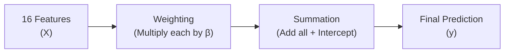
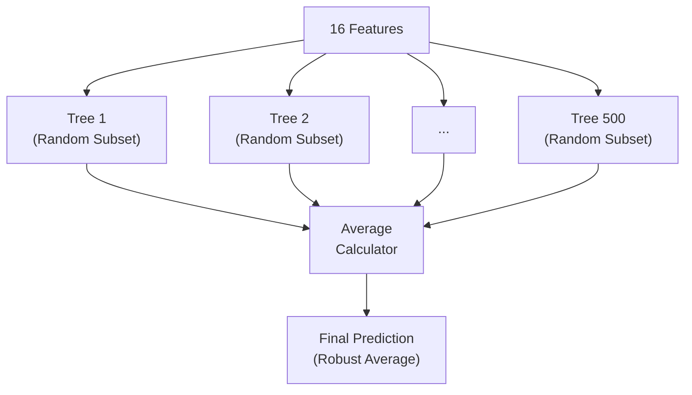
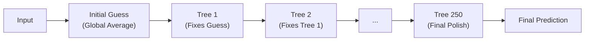

# Model Comparison: Why Random Forest

This project benchmarks `LinearRegression`, `GradientBoosting`, and `RandomForest`. RandomForest is selected because it delivers the best accuracy and stability across all evaluation splits. Results come from [outputs/metrics.txt](../outputs/metrics.txt) and [outputs/model_comparison.csv](../outputs/model_comparison.csv).

---

## Where Models Are Defined

| Model | Builder file | Key parameters |
|---|---|---|
| `LinearRegression` | [linear_regression.py — L4–5](../src/model_implementation/model_zoo/linear_regression.py#L4-L5) | Default sklearn settings |
| `RandomForest` | [random_forest.py — L5–12](../src/model_implementation/model_zoo/random_forest.py#L5-L12) | 500 trees, max_depth=15, max_features="sqrt" |
| `GradientBoosting` | [gradient_boosting.py — L5–11](../src/model_implementation/model_zoo/gradient_boosting.py#L5-L11) | 250 trees, learning_rate=0.05, subsample=0.9 |

All three are assembled into one dictionary at [model_zoo/\_\_init\_\_.py — L6–11](../src/model_implementation/model_zoo/__init__.py#L6-L11) and looped over in [train_model.py — L57–90](../src/model_implementation/train_model.py#L57-L90).


---

## Model Pipelines: How They Work

Each model processes the 16 input features differently. Understanding these "pipelines" helps explain why RandomForest is the superior choice for this specific data.

### 📐 Linear Regression Pipeline (Simple Arithmetic)
This model treats every relationship as a straight line. It is fast and transparent but cannot see "combinations" of features.



1.  **Multiply:** Each feature (like `queue_length`) is multiplied by its weight (Beta).
2.  **Sum:** All these products are added up.
3.  **Adjust:** The `Intercept` is added to center the result.
4.  **Simplicity:** It assumes that if `queue_length` increases by 1, the wait *always* increases by the same amount, regardless of whether it's Monday or Wednesday.

### 🌲 Random Forest Pipeline (Parallel Wisdom)
Our winning model. It uses **Bagging** (Bootstrap Aggregating) to combine 500 different perspectives simultaneously.



1.  **Diversification:** 500 decision trees are built in parallel. Each tree only sees a random piece of the data.
2.  **Interaction:** Trees can learn rules like *"IF hour < 10 AND day = Monday, THEN wait is high."*
3.  **Averaging:** By averaging 500 different "opinions," the model cancels out random noise and outlier errors.
4.  **Stability:** This is why it performs so consistently across both random and chronological splits.

### 🚀 Gradient Boosting Pipeline (Sequential Correction)
A sophisticated "self-correcting" system that uses **Boosting** to learn from its own mistakes.



1.  **Iterative Learning:** It builds 250 trees one-by-one. Tree 2 is specifically designed to fix the errors made by Tree 1.
2.  **Small Steps:** Each tree only makes a tiny 5% correction (`learning_rate=0.05`). This prevents the model from "overreacting" to any single data point.
3.  **Refinement:** It starts with a broad guess and slowly "sharpens" the prediction as more trees are added.
4.  **Precision vs. Bias:** While very precise, it is slightly less robust than the Forest here because it relies too heavily on the "lag" features to make its corrections.

---


## Head-to-Head Results

Each model is evaluated using **3 methods** inside [`evaluate_model()`](../src/Evaluation/evaluation.py#L33):
- Random split — [evaluation.py — L45–49](../src/Evaluation/evaluation.py#L45-L49)
- Chronological split — [evaluation.py — L51–53](../src/Evaluation/evaluation.py#L51-L53) using [splits.py — L4–23](../src/Evaluation/splits.py#L4-L23)
- 5-fold cross-validation — [evaluation.py — L55–66](../src/Evaluation/evaluation.py#L55-L66)

Then averaged into `robust_mae` at [evaluation.py — L75](../src/Evaluation/evaluation.py#L75).

| Model | Test MAE | Chrono MAE | CV MAE | **Robust MAE** | Test R² |
|---|---|---|---|---|---|
| **RandomForest ✅** | 2.92 | 2.74 | 2.89 | **2.85** | 0.9637 |
| GradientBoosting | 3.09 | 2.93 | 3.00 | 3.01 | 0.9613 |
| LinearRegression | 4.44 | 4.12 | 4.39 | 4.32 | 0.9248 |

**What the metrics mean:**
- **MAE** — average error in minutes. Lower = better.
- **R²** — how much of the wait-time variation the model explains. Closer to 1 = better.
- **Robust MAE** — average of all three MAEs. Reflects stability, not just one lucky split.

The winner is picked at [train_model.py — L89–90](../src/model_implementation/train_model.py#L89-L90):
```python
if selected_result is None or result["robust_mae"] < selected_result["robust_mae"]:
    selected_result = result
```

---

## Full Training Output (Explained)

This is the actual output from `train_model.py` during Step 4/6, with every value explained.

---

### 📐 Model 1 — LinearRegression

```
┌─ 🔄 Now training: LinearRegression...
│   Random split  → MAE: 4.44 min  |  R²: 0.9248
│   Chrono split  → MAE: 4.12 min  |  R²: 0.9235
│   5-Fold CV     → MAE: 4.39 min  |  R²: 0.9242
│
│   📐 Formula: ŷ = β₀ + β₁x₁ + β₂x₂ + ... + β₁₆x₁₆
│   Intercept (β₀)  : -0.3243
│   Top coefficients (how much each feature shifts wait time):
│     is_peak_day                    β = +6.1932  ↑
│     is_peak_hour                   β = +3.9660  ↑
│     is_holiday                     β = -1.8528  ↓
│     is_weekend                     β = +1.2577  ↑
│     is_pre_holiday                 β = +0.9739  ↑
└─ ✅ Robust MAE: 4.32 min
```

#### What every value means:

| Value | Meaning |
|---|---|
| **MAE: 4.44 min** | On average, predictions are off by 4.44 minutes. That's decent but the worst of the 3 models. |
| **R²: 0.9248** | The model explains 92.5% of the variation in wait times. Good, but leaves 7.5% unexplained. |
| **ŷ = β₀ + β₁x₁ + ...** | The model's formula — a weighted sum of all 16 features. Each β is a weight learned during training. |
| **Intercept (β₀) = -0.3243** | The "starting point" of the prediction before any features are considered. A value near 0 means the features alone drive the prediction (the model doesn't have a large built-in bias). |
| **β(is_peak_day) = +6.1932 ↑** | Being on a peak day (Monday or Friday) adds **+6.19 minutes** to the predicted wait. This is the single most influential feature. |
| **β(is_peak_hour) = +3.9660 ↑** | Being during a peak hour (9–11am, 2–3pm) adds **+3.97 minutes**. |
| **β(is_holiday) = -1.8528 ↓** | Holidays **reduce** the predicted wait by 1.85 minutes (fewer people show up). The ↓ arrow means negative = decreases wait. |
| **β(is_weekend) = +1.2577 ↑** | Saturdays add +1.26 minutes vs weekdays. |
| **β(is_pre_holiday) = +0.9739 ↑** | The day before a holiday adds +0.97 minutes (pre-holiday rush). |
| **Robust MAE: 4.32** | Average of all 3 MAEs: (4.44 + 4.12 + 4.39) ÷ 3 = 4.32. This is the score used to compare models. |

> **Why it loses:** Linear Regression can only add or subtract fixed amounts per feature. It can't capture interactions like "Monday + 10am + end-of-month = extra bad." It treats Monday-at-8am the same as Monday-at-10am (after the peak_hour coefficient) — but in reality, the pattern is more complex.

---

### 🌲 Model 2 — RandomForest

```
┌─ 🔄 Now training: RandomForest...
│   Random split  → MAE: 2.92 min  |  R²: 0.9637
│   Chrono split  → MAE: 2.74 min  |  R²: 0.9618
│   5-Fold CV     → MAE: 2.89 min  |  R²: 0.9636
│
│   🌲 Formula: ŷ = average of 500 decision trees
│   Trees        : 500  |  Max depth: 15
│   Actual depths: min=15, avg=15.0, max=15
│   Top feature importances (how much each feature reduces prediction error):
│     queue_length_at_arrival        0.2685  ██████████
│     waiting_time_lag1              0.2656  ██████████
│     service_time_min               0.1726  ██████
│     queue_length_lag1              0.1114  ████
│     is_peak_day                    0.0819  ███
└─ ✅ Robust MAE: 2.85 min
```

#### What every value means:

| Value | Meaning |
|---|---|
| **MAE: 2.92 min** | Predictions are off by only 2.92 minutes on average — **34% better** than LinearRegression's 4.44. |
| **R²: 0.9637** | Explains 96.4% of the variation — leaves only 3.6% unexplained. |
| **500 decision trees** | The forest contains 500 separate trees, each trained on a random subset of data. The final prediction is the average of all 500 trees' answers. More trees = more stable predictions. |
| **Max depth: 15** | Each tree is allowed to split up to 15 times deep. This controls complexity — deeper trees can learn more specific patterns but risk memorizing noise. |
| **Actual depths: min=15, avg=15.0, max=15** | All 500 trees grew to the full allowed depth of 15. This means the data has enough patterns to fill all 15 levels — the trees aren't being starved of information. |
| **queue_length_at_arrival: 0.2685** | The #1 most important feature — **26.85%** of the model's decision-making power comes from how many people are in line when you arrive. This makes intuitive sense: more people = longer wait. |
| **waiting_time_lag1: 0.2656** | The #2 feature — **26.56%** importance. How long the *previous person* waited is almost equally important. It's the model's "memory" of recent queue conditions. |
| **service_time_min: 0.1726** | **17.26%** importance. How long the current transaction takes directly affects wait time (complex transactions = slower service). |
| **queue_length_lag1: 0.1114** | **11.14%** importance. The queue length from the *previous* transaction — provides momentum information (is the queue growing or shrinking?). |
| **is_peak_day: 0.0819** | **8.19%** importance. Monday/Friday flag — less important individually because the model already captures day patterns through queue length and lag features. |
| **Robust MAE: 2.85** | (2.92 + 2.74 + 2.89) ÷ 3 = 2.85 — **the lowest of all 3 models → WINNER**. |

> **Why it wins:** Random Forest can learn complex interactions like "Monday + 10am + queue > 30 = very long wait" because each tree splits on different combinations of features. The 500-tree average smooths out noise, and the feature importance shows it correctly identified queue_length and lag features as most predictive.

---

### 🚀 Model 3 — GradientBoosting

```
┌─ 🔄 Now training: GradientBoosting...
│   Random split  → MAE: 3.09 min  |  R²: 0.9613
│   Chrono split  → MAE: 2.93 min  |  R²: 0.9581
│   5-Fold CV     → MAE: 3.00 min  |  R²: 0.9624
│
│   🚀 Formula: ŷ = F₀ + η·h₁(x) + η·h₂(x) + ... + η·h₂₅₀(x)
│   Trees (stages): 250  |  Learning rate (η): 0.05
│   Max depth per tree: 3  |  Subsample: 0.9
│   Top feature importances:
│     waiting_time_lag1              0.7562  ██████████████████████████████
│     queue_length_at_arrival        0.2089  ████████
│     is_peak_hour                   0.0088
│     hour                           0.0088
│     service_time_min               0.0085
└─ ✅ Robust MAE: 3.01 min
```

#### What every value means:

| Value | Meaning |
|---|---|
| **MAE: 3.09 min** | Predictions are off by 3.09 minutes — better than Linear (4.44) but worse than RandomForest (2.92). |
| **R²: 0.9613** | Explains 96.1% of variation — very close to RandomForest's 96.4%. |
| **ŷ = F₀ + η·h₁(x) + η·h₂(x) + ...** | The formula: Start with an initial prediction (F₀), then add 250 small corrections. Each h(x) is a shallow tree that fixes the mistakes of all previous trees. |
| **Trees (stages): 250** | 250 sequential correction rounds. Unlike RandomForest (which builds trees independently), Gradient Boosting builds them one after another, each focusing on the remaining errors. |
| **Learning rate (η): 0.05** | Each tree is only allowed to correct **5%** of the remaining error. This "slow learning" prevents overcorrection — like taking tiny careful steps instead of big jumps. Lower η = more stable but needs more trees. |
| **Max depth per tree: 3** | Each tree is deliberately **very shallow** (only 3 splits). A depth-3 tree can only learn simple rules like "if queue > 20 AND peak_day = 1, add X minutes." The complexity comes from combining 250 of these simple rules. |
| **Subsample: 0.9** | Each tree only sees a random **90%** of the training data. The other 10% is held out as regularization — this prevents any single tree from memorizing noise. |
| **waiting_time_lag1: 0.7562** | **75.62%** of the model's power comes from the previous person's wait time. This is much more concentrated than RandomForest (26.56%), meaning GradientBoosting is heavily dependent on this one feature. |
| **queue_length_at_arrival: 0.2089** | **20.89%** importance — the second most important feature, but far behind lag wait. |
| **is_peak_hour: 0.0088** | Only **0.88%** importance — almost negligible. The model barely uses peak_hour directly because the lag features already encode this information indirectly. |
| **Robust MAE: 3.01** | (3.09 + 2.93 + 3.00) ÷ 3 = 3.01 — second place, 6% worse than RandomForest. |

> **Why it loses:** GradientBoosting is over-reliant on `waiting_time_lag1` (75.6%). If that one feature is noisy or unavailable, the model degrades. RandomForest spreads its attention more evenly across multiple features (26.8% + 26.6% + 17.3%), making it more robust.

---

### 📊 Benchmark Table

```
======================================================================
📊 MODEL BENCHMARK RESULTS (ranked by Robust MAE)
======================================================================
   Model                    Robust MAE   Test MAE   Chrono MAE   Test R²
   ------------------------------------------------------------------
   RandomForest                 2.85       2.92         2.74    0.9637 ← WINNER
   GradientBoosting             3.01       3.09         2.93    0.9613
   LinearRegression             4.32       4.44         4.12    0.9248

   Baseline (always guess avg): MAE = 18.18 min  |  R² = -0.0002
   Best model (RandomForest) beats baseline by 15.26 min MAE
======================================================================
```

#### What the benchmark values mean:

| Value | Meaning |
|---|---|
| **Robust MAE** | The deciding metric — average of Random split + Chrono split + 5-Fold CV MAE. Lower = better. |
| **Test MAE** | Error on the random 20% holdout set. |
| **Chrono MAE** | Error on the newest 20% of dates (future prediction test). |
| **Test R²** | Fraction of variance explained on the random holdout (1.0 = perfect). |
| **Baseline MAE: 18.18** | What you'd get by **always guessing the average wait time** (no ML at all). This proves the models are actually learning something useful. |
| **R² = -0.0002** | The baseline's R² is essentially 0 — it explains none of the variation (it just guesses one number for everything). |
| **Beats baseline by 15.26 min** | RandomForest's MAE (2.92) vs baseline's MAE (18.18) = 15.26 min improvement. The ML model is **6.2× more accurate** than naive guessing. |

---

## Why RandomForest Works Best Here

Written to `metrics.txt` at [reporting.py — L60–63](../src/Evaluation/reporting.py#L60-L63).

1. **Nonlinear patterns** — Queue dynamics are not linear. RandomForest captures interactions between time, queue length, and lag features naturally.
2. **Handles mixed feature types** — Works with numeric + binary flags without manual scaling.
3. **Stable under noise** — 500 trees ([random_forest.py — L6](../src/model_implementation/model_zoo/random_forest.py#L6)) reduce variance and handle synthetic noise better than a single model.
4. **Consistent generalization** — Best on both random and chronological splits, proving it works on unseen future dates.

---

## Why the Other Models Lose

Written to `metrics.txt` at [reporting.py — L65–68](../src/Evaluation/reporting.py#L65-L68).

- **`LinearRegression`** — Too simple. It draws one straight line through all the data. Queue wait times don't follow a straight line (Monday 10am is much worse than Wednesday 10am, even at the same queue length). This causes a MAE of 4.44 vs RandomForest's 2.92.
- **`GradientBoosting`** — Competitive but slightly weaker. It uses only 250 trees ([gradient_boosting.py — L6](../src/model_implementation/model_zoo/gradient_boosting.py#L6)) with a slow learning rate, which limits capacity on this dataset. Its robust MAE of 3.01 is still 6% worse than RandomForest.

---

## Tradeoffs

| Concern | Reality |
|---|---|
| Training speed | RandomForest is slower than LinearRegression, but still finishes in seconds |
| Interpretability | Lower than linear, but feature importance is available at [evaluation.py — L10–30](../src/Evaluation/evaluation.py#L10-L30) |
| Overfitting risk | Controlled by `max_depth=15`, `min_samples_leaf=2` at [random_forest.py — L7–9](../src/model_implementation/model_zoo/random_forest.py#L7-L9) |

---

## Final Decision

RandomForest is saved as the model artifact at [train_model.py — L110](../src/model_implementation/train_model.py#L110):
```python
joblib.dump(selected_result["model"], MODEL_PATH)
```
It is then loaded at prediction time by [context.py — L21](../src/Prediction/context.py#L21):
```python
model = joblib.load(MODEL_PATH)
```

It wins because it has the lowest robust MAE (2.85), the highest R² (0.9637), and the most consistent performance across all three evaluation methods.
